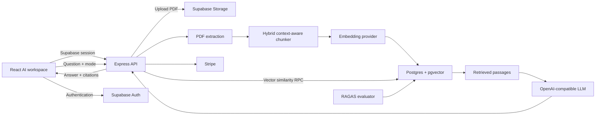

# DocuMind - RAG Document Chatbot SaaS

An AI workspace for learning from private PDF documents. Upload a document, retrieve
relevant passages with Supabase pgvector, generate source-aware answers, and use a
Socratic tutor that challenges assumptions one focused question at a time.

Built with React, TypeScript, Express, Supabase, pgvector, OpenAI-compatible APIs,
Stripe, and RAGAS.


## Highlights

- Supabase email/password authentication and protected application routes
- PDF upload to private Supabase Storage
- Backend PDF extraction with `pdf-parse`
- Hybrid context-aware chunking that preserves headings, paragraphs, lists, pages,
  and section context
- OpenAI `text-embedding-3-small` support with a deterministic local development
  embedding fallback
- Supabase pgvector cosine-similarity retrieval
- Grounded answers with page numbers, snippets, and citations
- Persistent threads, messages, and monthly usage tracking
- Direct-answer and Socratic learning modes
- Stripe Checkout, Customer Portal, and subscription webhooks
- RAGAS evaluation for faithfulness, answer relevancy, context precision, and
  context recall
- Responsive, prompt-first AI workspace interface

## Tech Stack

| Layer | Technology |
| --- | --- |
| Frontend | React 19, Vite, TypeScript, Tailwind CSS |
| UI | Framer Motion, Lucide React |
| API | Node.js, Express, TypeScript, Zod |
| Authentication | Supabase Auth |
| Database | Supabase Postgres |
| Vector search | Supabase pgvector |
| File storage | Supabase Storage |
| PDF extraction | `pdf-parse` |
| Embeddings | OpenAI or local 1536-dimensional feature hashing |
| Generation | OpenAI/Groq-compatible chat-completions API |
| Billing | Stripe Checkout and Customer Portal |
| Evaluation | Python, RAGAS |

## Architecture



## RAG Pipeline

1. The authenticated user uploads a PDF.
2. The API stores the original file in Supabase Storage.
3. `pdf-parse` extracts page-aware text.
4. The hybrid chunker detects headings, paragraphs, and lists, then packs related
   content into bounded chunks.
5. Each chunk receives a 1536-dimensional embedding.
6. Chunks, page numbers, section metadata, and vectors are stored in Postgres.
7. A question is embedded and passed to `match_document_chunks`.
8. The most relevant passages are supplied to the configured LLM.
9. The answer and page-level citations are saved in the chat history.

Socratic mode also loads recent conversation history, distinguishes evidence from
inference, presents document-grounded objections, and ends with one focused
follow-up question.

## Repository Structure

```text
rag-document-chatbot-saas/
|-- client/          React + Vite application
|-- server/          Express API
|-- supabase/        Schema, RLS, RPC, and repair migrations
|-- ragas-eval/      RAGAS dataset, evaluator, and tests
`-- README.md
```

## Prerequisites

- Node.js 20 or newer
- npm
- Python 3.10 or newer for RAGAS
- A Supabase project
- An OpenAI or Groq-compatible API for generated answers
- A Stripe account for billing features

## Local Setup

### 1. Clone and enter the project

```bash
git clone <your-repository-url>
cd <repository-folder>/rag-document-chatbot-saas
```

### 2. Install dependencies

```bash
cd client
npm install

cd ../server
npm install
```

### 3. Configure Supabase

Open the Supabase SQL Editor and run:

```text
supabase/setup.sql
```

This creates the tables, pgvector extension, indexes, similarity-search function,
profile trigger, Row Level Security policies, and the private `documents` storage
bucket.

If upgrading an older local schema, targeted repair scripts are available:

- `supabase/repair_documents.sql`
- `supabase/repair_document_chunks.sql`
- `supabase/repair_embedding_dimensions.sql`

The embedding column and RPC must use `vector(1536)`.

### 4. Configure environment variables

Create `client/.env` from `client/.env.example`:

```env
VITE_API_URL=http://localhost:4000
VITE_DEV_AUTO_CONFIRM_EMAIL=false
VITE_SUPABASE_URL=https://your-project-ref.supabase.co
VITE_SUPABASE_ANON_KEY=your-supabase-publishable-key
```

Create `server/.env` from `server/.env.example`:

```env
PORT=4000
NODE_ENV=development
DEV_AUTO_CONFIRM_EMAIL=false
CLIENT_URL=http://localhost:5173

SUPABASE_URL=https://your-project-ref.supabase.co
SUPABASE_SERVICE_ROLE_KEY=your-supabase-service-role-key
SUPABASE_STORAGE_BUCKET=documents

OPENAI_API_KEY=
EMBEDDING_PROVIDER=local

LLM_API_KEY=your-llm-api-key
LLM_BASE_URL=
LLM_MODEL=gpt-4o-mini

MAX_PDF_SIZE_MB=100

STRIPE_SECRET_KEY=
STRIPE_WEBHOOK_SECRET=
STRIPE_PRO_PRICE_ID=
STRIPE_TEAM_PRICE_ID=
```

Never expose `SUPABASE_SERVICE_ROLE_KEY`, LLM keys, or Stripe secrets through a
`VITE_` variable.

### 5. Start the application

In one terminal:

```bash
cd rag-document-chatbot-saas/server
npm run dev
```

In another terminal:

```bash
cd rag-document-chatbot-saas/client
npm run dev
```

Open `http://localhost:5173`.

The API health endpoint is available at `http://localhost:4000/health`.

## Authentication

Production signup follows the email-confirmation behavior configured in Supabase.

For local development only, confirmation can be bypassed by enabling both flags:

```env
# server/.env
NODE_ENV=development
DEV_AUTO_CONFIRM_EMAIL=true

# client/.env
VITE_DEV_AUTO_CONFIRM_EMAIL=true
```

The development endpoint is disabled unless the server is running in development
mode and the explicit flag is enabled.

## Embedding Providers

### Local development

```env
EMBEDDING_PROVIDER=local
```

This produces deterministic, normalized 1536-dimensional feature-hash vectors
without an external embedding API. It is useful for development, but OpenAI
embeddings provide stronger semantic retrieval.

### OpenAI

```env
EMBEDDING_PROVIDER=openai
OPENAI_API_KEY=your-openai-api-key
```

The server uses `text-embedding-3-small` with 1536 dimensions.

## LLM Configuration

OpenAI:

```env
LLM_API_KEY=your-openai-api-key
LLM_BASE_URL=
LLM_MODEL=gpt-4o-mini
```

Groq-compatible API:

```env
LLM_API_KEY=your-provider-key
LLM_BASE_URL=https://api.groq.com/openai/v1
LLM_MODEL=your-supported-model
```

The LLM is instructed to answer only from retrieved document context.

## Stripe Setup

1. Create recurring Pro and Team prices in Stripe.
2. Add their IDs to `STRIPE_PRO_PRICE_ID` and `STRIPE_TEAM_PRICE_ID`.
3. Configure the webhook endpoint:

```text
POST https://your-api.example.com/api/stripe/webhook
```

4. Subscribe to Checkout and subscription lifecycle events.
5. Add the signing secret to `STRIPE_WEBHOOK_SECRET`.

Authenticated billing endpoints:

- `POST /api/stripe/create-checkout-session`
- `POST /api/stripe/customer-portal`

## RAGAS Evaluation

```bash
cd rag-document-chatbot-saas/ragas-eval
python -m venv .venv
```

Activate the environment and install dependencies:

```bash
pip install -r requirements.txt
```

Configure the required provider and Supabase variables, update `dataset.json`, then
run:

```bash
python eval.py --dataset dataset.json
```

Results can be persisted to the `rag_evaluations` table. The evaluator measures:

- Faithfulness
- Answer relevancy
- Context precision
- Context recall

## Quality Checks

```bash
# Frontend
cd rag-document-chatbot-saas/client
npm run lint
npm run build

# Backend
cd ../server
npm test
npm run build

# RAGAS evaluator
cd ../ragas-eval
python -m unittest test_eval.py
```

## Security

- Protected API routes verify Supabase Bearer tokens.
- Service-role and provider secrets stay on the server.
- Database access is constrained by Row Level Security.
- Uploads validate PDF MIME type, extension, signature, and plan limits.
- Chat and retrieval verify document ownership.
- Stripe webhooks use signature verification.
- Request bodies are validated with Zod.

## Deployment

### Frontend

Deploy `client` to Vercel, Netlify, or another Vite-compatible host. Configure the
`VITE_*` variables and point `VITE_API_URL` to the deployed API.

### Backend

Deploy `server` to Railway, Render, Fly.io, or a Node-compatible host:

```bash
npm run build
npm start
```

Configure all server environment variables and set `CLIENT_URL` to the deployed
frontend origin.

### Database and storage

Use Supabase for Postgres, pgvector, Auth, and Storage. Run `supabase/setup.sql`
before deploying the application.

## Current Notes

- The frontend uses some demo document/thread data while backend list endpoints are
  completed.
- A configured LLM is required for generated chat answers.
- Existing documents must be uploaded again after changing embedding dimensions or
  chunking strategy.

## License

Add a license before distributing this project publicly.
